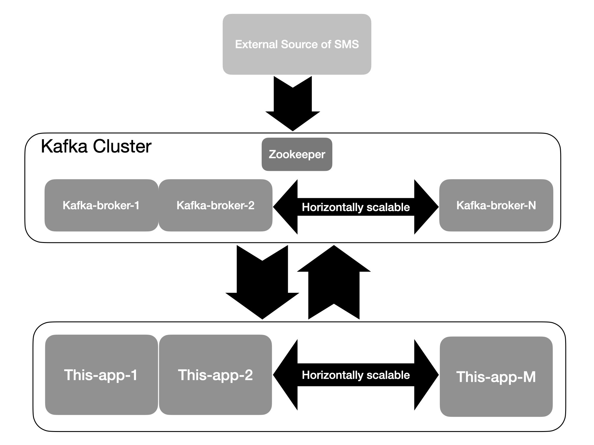

# Założenia

Zakładam, że SMSy trafiają do systemu kolejkowego typu Kafka. 

Zakładam, że każdy użytkownik na starcie ma taką ochronę uruchomioną defaultowo. I że nie wymaga ona włączenia. Po jej
wyłączeniu można ją normalnie włączyć tak jak zostało to narzucone w treści zadania. 

Zakładam, że dane wejściowym topicu są przechowywane w schemacie: klucz to `null` a wartość to SMS zapisany jako JSON 
string. Nullowanie klucza ma tę cechę, że *round-robin'uje* nam dane między partycjami topika, choć w tym przypadku nie 
będzie to miało żadnego znacznia.

Zakładam, ze w SMSie może być więcej niż jeden URI.

Zakładam również, że w przypadku gdy użytkownik ma włączoną ochronę, w smsie jest Uri, w naszej *bazie* nie ma informacji 
o tym uri a servis nie odpowiada, to, że taki sms przechodzi dalej, przy czym uri trawia do ponownego sprawdzenia.  

# Architektura
Architektura tego rozwiązania zakłada istnienie klastra brokerów Kafki z którego można zaciągać dane z SMSami, przechowywać
informacje o statusie ochrony użytkownika, poziomie bezpieczeństwa danego URI oraz na który ma trafić SMSowy output z aplikacji. 

## Korzyści z takiej architektury
Pełna skalowalność. Możemy mieć tyle egzemplarzy tej aplikacji ile wynosi 
partycjonowanie danych w topicach. Jeśli w klastrze mamy kilka brokerów to dodatkowo jesteśmy zabezpieczeni na wypadek 
awarii jednego czy kilku z nich (ale nie wszystkich naraz 😵). 

# Topologia
Na poniższym schemacie przedstawiona została topologia strumieni i ich przekształceń. Analizę najlepiej zacząć od lewego 
dolnego rogu, gdzie znajduje się topic wejściowy z sms'ami `sms_input`. Nazwy strumieni na schemacie odpowiadają tym w aplikacji, 
dzięki czemu łatwiej jest śledzić przepływ danych. Wbrew pozorom, implementacja tej topologii to mniej niż 200 linii kodu. 

 
Przedstawiona topologia wymaga oprócz topiku wejściowego `sms_input` utworzenia kilku dodatkowych topików.
Topiki te są tworzone automatycznie przy uruchamianiu aplikacji, a ich parametry takie jak stopień replikacji i
stopień partycjonownaia można skonfigurować w pliku konfiguracyjnym `application.conf`. Nie można natomiast modyfikować
ich czasu retencji. Jest on ustawiony na nieskończoność. Jest to zabezpieczenie przed gubieniem danych. 
I tak przy uruchamianiu aplikacji tworzymy dodatkowo następujące topiki:

* `sms_output` - topic na który będą trafiały wszystkie smsy, które:
  * są wysłane do użytkowników z wyłączoną ochroną,
  * są wysłane do użytkowników z włączoną ochroną i nie zawierają żadnych linków,
  * są wysłane do użytkowników z włączoną ochroną i zawierają linki z Confidence Level maksymalnie na poziomie `LOW`,
* `user_status` - Ponieważ w założeniach przyjąłem, że użytkownik na starcie ma zapewnioną ochronę, to nie jest konieczne
  przechowywanie informacji o użytkownikach z aktywną usługą. Dlatego w tym topiku przechowywane są informacje tylko o 
  użytkownikach mających wyłączoną usługę. Takie rozwiązanie jest korzystne z dwóch powodów. Po pierwsze, mniej rekordów będzie 
  do przeszukania, po drugie, mniej danych przechowujemy na brokerze, co przy restarcie aplikacji będzie powodowało szybsze jej
  uruchomienie. W topiku dane są w postaci klucz to `user_num` string a wartość
  to stringowy `"false"` lub pusta referencja `null`. Dane są zaciągane do obiektu GlobalKTable co oznacza, że są one tak samo rozdysponowane
  pomiędzy wszystkie egzemplarze uruchomionej aplikacji. W przypadku gdy użytkownik wyłącza ochronę do topika zapisywany jest
  rekord: w postaci klucz `user_num` a wartość `"false"`. Ponowne włączenie usługi spowoduje zapisanie do topica rekordu z
  `null`em jako wartością. To automatycznie usuwa usera z GlobalKTable. 
* `uri_confidence_level` - topik w którym przechowujemy informację o URI (klucz) i jego *Confidence Level* (wartość). Obie
  dane są przechowywane w postaci stringów. Dane są wczytywane do GlobalKTable dzięki czemu wszystkie instancje aplikacji
  mają taką samą postać tej tabeli.  
* `sms_with_many_uri` -  jest to *pętlowy* topik, który służy nam do iteracyjnego sprawdzania wszystkich liknków znalezionych 
  w SMSie. Dzieje się tak do momentu, aż któryś z linków okaże się niebezpieczny wtedy taki SMS wypada z obiegu 
  (są w nim tylko SMSy z URI i aktywną ochroną) a pozostałe linki z SMSa trafiają do topica `uri_to_check`, żeby 
  zostały sprawdzone, i nabudowywały nam naszą tablicę `uri_table`.
* `uri_to_check` - jest to topic do którego trafiają adresy URI pochodzące z SMSów użytkowników z włączoną ochroną,
  które to SMSy zostały odrzucone bo nieostatni znaleziony w wiadomości link był niebezpieczny. Takie URI są 
  następnie ponownie zaciągane do aplikacji i jeśli nie ma ich w naszej tablicy `uriTable` to dla nich też zostanie 
  sprawdzony status. Status ten następnie trafi do tejże tablicy. 

W celu zmniejszenia ilości przechowywanych na brokerze danych, można by takie topiki jak `sms_with_many_uri` i `uri_to_check` skonfigurować
z ograniczonym czasem retencji.

# Uruchomienie
TODO

## SSL
Aplikacja defaultowo nie łączy się jeszcze przez SSL.

Aby to umożliwić konieczne jest wykonanie kilku kroków:
* umieszczenie odpowiedniego certyfikatu w folderze `play-with-me/kafka-sms-analyser`, tak aby mógł on być zaciągnięty 
  przez Dockera do tworzonego obrazu. 
* odkomentowania linijki w Dockerfile przekopiowującej certyfikat. Nazwa certyfikatu w linijce powinna być zgodna z
  nazwą pliku. (certyfikat będzie w obrazie w tym samym folderze co JAR tak aby aplikcaja mogła go sobie łatwo znaleźć)
* zmiany parametru `kafka-sms-analyser.kafka-security.protocol.ssl.certificate` w pliku `application.conf` na nazwę pliku
  certyfikatu, tak aby aplikacja mogła go wczytać i umieścić w `trustStore.jks`.
* odkomentowania danych konfiguracyjnych w metodzie 
  [`main()`](https://github.com/malyszaryczlowiek/play-with-me/blob/1-dev-branch/kafka-sms-analyser/src/main/scala/SmsAnalyser.scala) 
  oraz w obiekcie 
  [`TopicCreator`](https://github.com/malyszaryczlowiek/play-with-me/blob/1-dev-branch/kafka-sms-analyser/src/main/scala/util/TopicCreator.scala)
* Aplikacja przy uruchomieniu tworzy oba pliki (`keyStore.jks` i `trustStore.jks`) jednocześnie wstawiając certyfikat do
  `trustStore.jks`.

Takie rozwiązanie SSL zdążyłem zaimplementować, ale nie zdążyłem przetestować czy w ogóle zadziała, dlatego jest ono w kodzie
źródłowym zakomentowane. Bardzo możliwe, że coś w takim rozwiązaniu jest nie tak.  

# What TODO
Co można by jeszcze zmodyfikować/poprawić? 
* Poprawić działanie UriSearcher, tak aby lepiej (?) wyłuskiwał linki z smsów.
* Dodanie logowania z Log4j2. 
* i pewnie jeszcze kilka rzeczy
