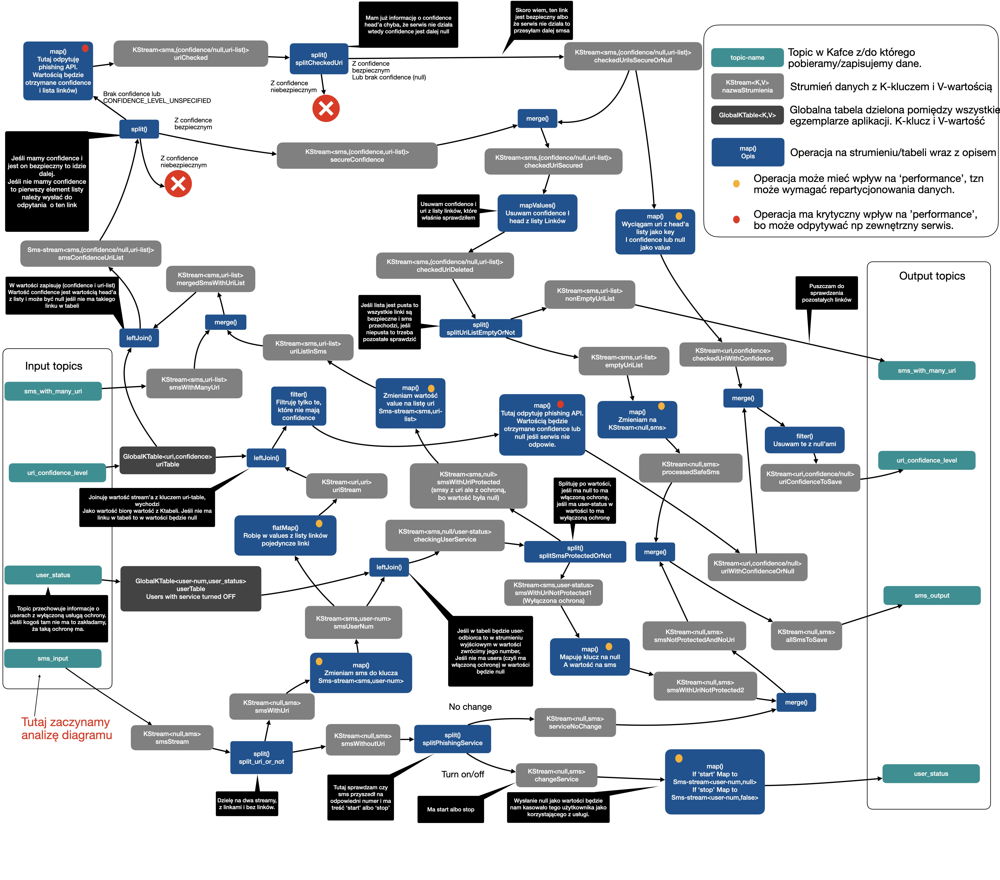

# Założenia

Zakładam, że każdy użytkownik na starcie ma taką ochronę uruchomioną defaultowo. I że nie wymaga ona włączenia. Po jej
wyłączeniu można ją normalnie włączyć tak jak zostało to narzucone w treści zadania. 

Zakładam, że dane wejściowym topicu są przechowywane w schemacie: klucz to `null` a wartość to SMS zapisany jako JSON 
string. Nullowanie klucza ma tę cechę, że *round-robin'uje* nam dane między partycjami topika, choć w tym przypadku nie 
ma to żadnego znacznia.

Zakładam, ze w SMSie może być więcej niż jeden URI.

# Architektura
Architektura tego rozwiązania zakłada istnienie klastra brokerów Kafki z którego można zaciągać dane z SMSami, przechowywać
informacje o statusie ochrony użytkownika, poziomie bezpieczeństwa danego URI oraz na który ma trafić SMSowy output. 

## Korzyści z takiej architektury
Pełna skalowalność. Możemy mieć tyle egzemplarzy tej aplikacji ile wynosi 
partycjonowanie danych w topicach. Jeśli w klastrze mamy kilka brokerów to dodatkowo jesteśmy zabezpieczeni na wypadek 
awarii jednego czy kilku z nich (ale nie wszystkich naraz 😵). 

# Topologia
Na poniższym schemacie przedstawiona została topologia strumieni i ich przekształceń. Analizę najlepiej zacząć od lewego 
dolnego rogu, gdzie znajduje się topic wejściowy z sms'ami `sms_input`. Nazwy strumieni na schemacie odpowiadają tym w aplikacji, 
dzięki czemu łatwiej jest śledzić przepływ danych. Wbrew pozorom, implementacja tej topologii to mniej niż 200 linii kodu. 

 
Przedstawiona topologia wymaga oprócz topiku wejściowego `sms_input` utworzenia kilku dodatkowych topików.
Topiki te są tworzone automatycznie przy uruchamianiu aplikacji, a ich parametry takie jak stopień replikacji i
stopień partycjonownaia można skonfigurować w pliku konfiguracyjnym `application.conf`. Nie można natomiast modyfikować
ich czasu retencji. Jest on ustawiony na nieskończoność. Jest to zabezpieczenie przed ewentualnym gubieniem danych. 
I tak:

* `sms_output` - topic na który będą trafiały wszystkie smsy, które:
  * są wysłane do użytkowników z wyłączoną ochroną,
  * są wysłane do użytkowników z włączoną ochroną i nie zawierają żadnych linków,
  * są wysłane do użytkowników z włączoną ochroną i zawierają linki z Confidence Level maksymalnie na poziomie `LOW`,
* `user_status` - 
* `uri_confidence_level` - 
* `sms_with_many_uri` -  
* `uri_to_check` -

Przypadek optymistyczny

Przypadek pesymistyczny - nie działa phishing API
W tym przypadku 

# Uruchomienie
TODO

# What TODO
Co można by jeszcze zmodyfikować/poprawić? 
* Poprawić działanie UriSearcher, tak aby lepiej (?) wyłuskiwał linki z smsów.
* Dodać łączenie przez SSL. 
* Dodanie logowania z Log4j2. 

